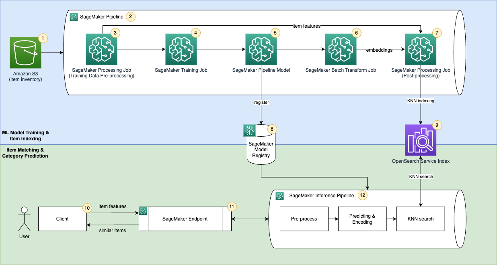
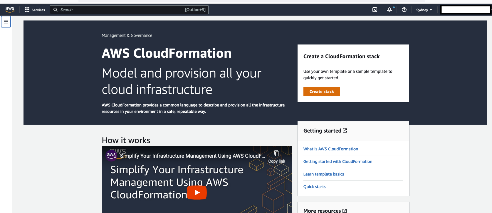
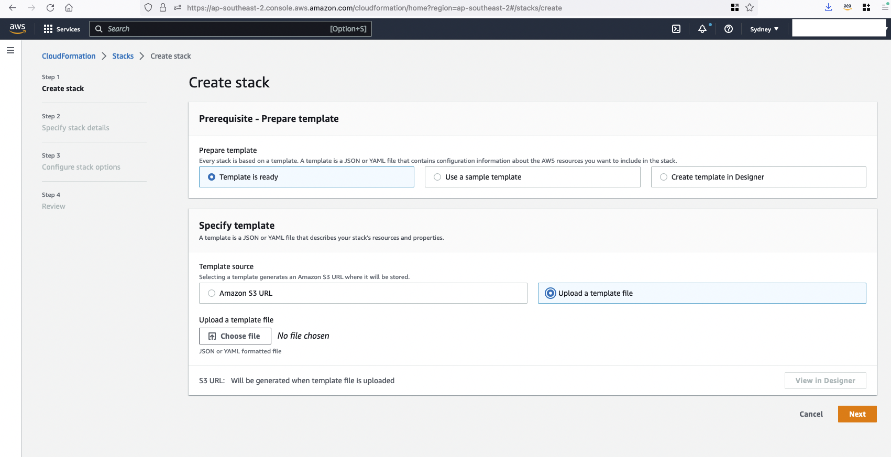
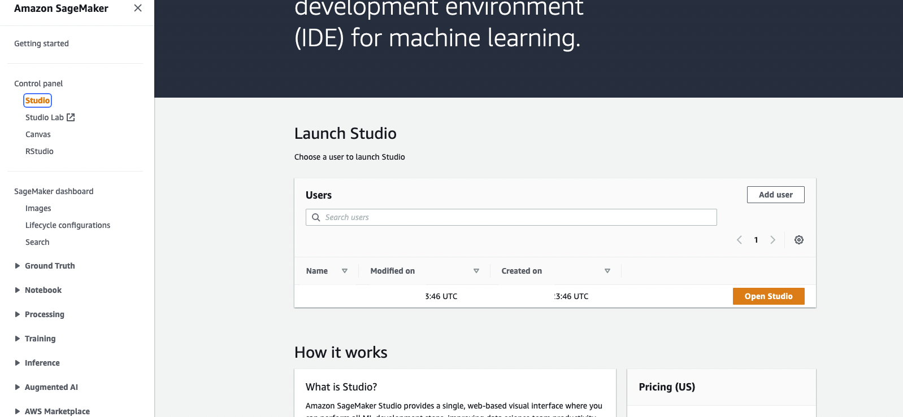

## Applying a "Transform, Encode, KNN search" framework to match items with Amazon SageMaker and Amazon OpenSearch Service

This repository aims to build a machine learning (ML) powered matching engine prototype that predicts product classes and finds similar items to support the prediction. The following is a step-by-step guide on how to build ML models in SageMaker using the HuggingFace container, encode product information into embeddings using the model, ingest the embeddings into the Amazon OpenSearch Service index, and query the index using the OpenSearch Service k-nearest neighbors (KNN) functionality.


The template provides a starting point for bringing your embedding based matching application to production.

```
|-- codebuild-buildspec.yml
|-- CONTRIBUTING.md
|-- pipelines
|   |-- sim_items
|   |   |-- __init__.py
|   |   `-- pipeline.py
|   |-- get_pipeline_definition.py
|   |-- __init__.py
|   |-- run_pipeline.py
|   |-- _utils.py
|   `-- __version__.py
|-- sim_items_src
|   |-- config.py
|   |-- __init__.py
|   |-- inference.py
|   |-- knn_index.py
|   |-- requirements.txt
|   `-- utils.py
|-- README.md
|-- sagemaker-similar-items.ipynb
|-- setup.cfg
|-- setup.py
|-- tests
|   |-- conftest.py
|   |-- integration
|   |   |-- test_components.py
|   |   |-- test_endpoint.py
|   |   `-- test_pipelines.py
|   `-- unit
|      `-- test_inference.py
`-- tox.ini
```

## Start here
This is a sample code repository that demonstrates how you can organize your code for an ML business solution. 
You can also use the `sagemaker-similar-items.ipynb` notebook to experiment from SageMaker Studio before you are ready to checkin your code.


### Solution overview

OpenSearch Service provides text-matching and embedding k-NN search. You will use embedding k-NN search in this solution. Implementing this matching application consists of two phases:  
•	ML Model Training & Item Indexing – In this phase, you use Amazon SageMaker Pipeline to orchestrate a MLOps pipeline which pre-process your raw input data, train a ML model to predict product category, encode item inventory into embeddings and store embeddings into a k-NN index in the OpenSearch Service.  
•	Item Matching & Category Prediction – This is the inference phase of the application. In this phase, you submit a query using product(s)’s raw features to an Amazon SageMaker Endpoint through a client.  The endpoint hosts an Amazon SageMaker Pipeline model which uses the trained ML model to predict category and search similar items from the  OpenSearch Service k-NN index. It returns the predicted and category and similar items to the client.   

#### Architecture


The solution uses the following AWS services and features:  
1.	You use Amazon S3 to store product information. 
2.	You create an Amazon SageMaker Pipeline to orchestrate the MLOps ML model training and item indexing workflow. 
3.	You use Amazon SageMaker Processing Job to transform raw product features. 
4.	You use Amazon SageMaker Training Job to predict product category.
5.	You create an Amazon SageMaker Pipeline model to run inference.
6.	You create a SageMaker Batch Transform jobs to encode items into embeddings. 
7.	You use Amazon SageMaker Processing Job to join item features and embeddings and then ingest them into an OpenSearch Service k-NN index. 
8.	You use SageMaker Model Registry to catalog models for deployment.
9.	You use OpenSearch Service as the search engine to store item features and embeddings and find similar embeddings. 
10.	You use a client to send requests to a SageMaker Endpoint and receive response. 
11.	You create a SageMaker Endpoint to host the product category prediction model. 
12.	You host the SageMaker Pipeline model to make prediction and search similar items from the OpenSearch Service index.
SageMaker Studio Notebooks(not in the diagram) will be used as IDE to develop the solution.

### Run the sample
Step 1: Go to CloudFormation Service in your AWS console.


Step 2: Upload a template to create a CloudFormation stack `sm-os-stack`.



Step 3: Check the status of CloudFormation stack. It will take around 20 mins to finish the creation.


Once the stack is created, you can go to the SageMaker Console and click Open Studio (user name: sample-user) to enter the Jupyter environment.


If during the execution, the CloudFormation shows errors about the OpenSearch service linked role can not be found. You need to create service-linked role by running `aws iam create-service-linked-role --aws-service-name es.amazonaws.com` in your AWS account.

II. Run the workflow
You open the file sagemaker-similar-items with the SageMaker Studio and use Data Science Python 3 kernel. You can execute cells from the start.

### Code structure
A description of some of the artifacts is provided below:
<br/><br/>
Your codebuild execution instructions (optional for using the workload in a notebook environment):
```
|-- codebuild-buildspec.yml
```
<br/><br/>
Your pipeline artifacts, which includes a pipeline module defining the required `get_pipeline` method that returns an instance of a SageMaker pipeline, a preprocessing script that is used in feature engineering, and an OpenSearch indexing script to ingest data to an OpenSearch service cluster is included in the pipeline:

```
|-- pipelines
|   |-- sim_items
|   |   |-- __init__.py
|   |   `-- pipeline.py

```
<br/><br/>
Utility modules for getting pipeline definition jsons and running pipelines:

```
|-- pipelines
|   |-- get_pipeline_definition.py
|   |-- __init__.py
|   |-- run_pipeline.py
|   |-- _utils.py
|   `-- __version__.py
```

<br/><br/>
SageMaker Processing jobs and SageMaker Model are going to use the following Python Module to preprecess data, ingest OpenSearch Index, and query the OpenSearch service index:
```
|-- sim_items_src
|   |-- config.py
|   |-- __init__.py
|   |-- inference.py
|   |-- knn_index.py
|   |-- requirements.txt
|   `-- utils.py
```

<br/><br/>
Python package artifacts:
```
|-- setup.cfg
|-- setup.py
```
<br/><br/>
A stubbed testing module for testing your pipeline as you develop:
```
|-- tests
|   |-- conftest.py
|   |-- integration
|   |   |-- test_components.py
|   |   |-- test_endpoint.py
|   |   `-- test_pipelines.py
|   `-- unit
|      `-- test_inference.py
```
<br/><br/>
The `tox` testing framework configuration:
```
`-- tox.ini
```


### Run tests

```
python build_config.py
python -m pytest -k test_pipelines_execution
```

## Dataset for the Example Similar item Pipeline

The dataset used is the [Amazon Customer Reviews Dataset](http://snap.stanford.edu/data/amazon/productGraph/). Amazon Customer Reviews (a.k.a. Product Reviews, Amazon product data
) is one of Amazon’s iconic products. In a period of over two decades since the first review in 1995, millions of Amazon customers have contributed over a hundred million reviews to express opinions and describe their experiences regarding products on the Amazon.com website. This makes Amazon Customer Reviews a rich source of information for academic researchers in the fields of Natural Language Processing (NLP), Information Retrieval (IR), and Machine Learning (ML), amongst others. 

The aim for this task is to determine the taxonomy of products, and we are using the metadata of the dataset. Metadata includes descriptions, price, sales-rank, brand info, and co-purchasing.